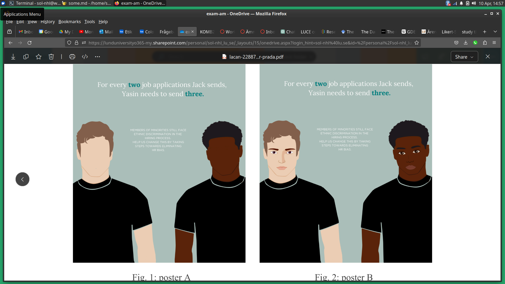

# Frågor om dig

Som första steg i studien vill vi ställa frågor om dig och din bakgrund.

## Födelseår

## Kön
• Man
• Kvinna
• Övrigt (Öppna avsnitt att fylla i)
• Föredrar att inte svara

## Vilken är din högsta genomförda utbildning?
• Gymnasie/yrkesutbildning
• BA
• MA
• PhD

## Även om du kanske inte identifierar dig med dessa grupper/kategorier, välj en grupp som gäller dig (välj mer än en om den är tillämplig):
• Asiatisk
• Vit/Europeisk
• Mellanöstern
• Latinamerikansk
• Svart/afrikansk
• Blandat
• Annat (öppen fråga)
• Föredrar att inte svara

---

# inoculation 1, forewarning

text about dei, equal opportunities in job market

---

# inoculation 2, prebunking

image depicting discriminatory practices in job market 

---

# Frågor om kulturen på arbetsplats/organisation/utbilding

## Vänligen ange hur mycket du håller med om följande påståenden på en skala 1-7 (1: håller inte med
alls, 7: håller med helt)

• Jag försöker närma mig andra utan fördomar, eftersom detta är viktigt för mig personligen.
• Diskriminering mot invandrare är inte längre ett problem i Sverige.
• Det har funnits tillräckligt med aktiva åtgärder för att skapa jobb för invandrare i Sverige.

## Vänligen svara i 1-5 (’håller inte med alls’ till ’håller med helt’) hur mycket du håller med påståendet hur du ser på din nuvarande arbetsplats/organisation/utbilding.

• Den strävar efter homogen personal.
• Det känns bättre att arbeta med andra som är liknande.
• Människor passar in i vår organisation när de liknar vår redan befintliga personal.
• Kvalifikationer spelar roll i min nuvarande organisation, inte bakgrund.
• Befordran är beroende av anställdas prestationer, inte deras bakgrund.
• Alla är välkomna så länge de uppfyller de nödvändiga kraven.
• Människor passar in i vår organisation när de matchar de arbetskvalifikationer som krävs.
• Människor passar in i vår organisation när de speglar demografin i det samhälle vi befinner
oss i.
• Kulturell mångfald tillför nya idéer och olika kunskaper till.
• Kulturell mångfald hjälper oss att utveckla nya färdigheter och arbetssätt.
• Organisationsstrategier bör anpassas för att nyttja de resurser som anställda från olika
bakgrunder tillför organisationen.

